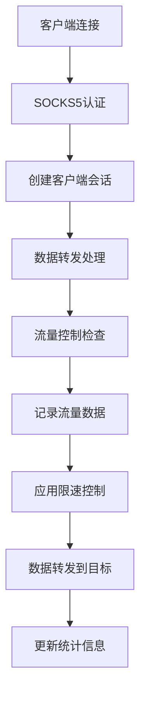

# SOCKS5代理限流机制文档

## 概述

本文档详细描述了SOCKS5代理项目的限流机制实现，包括流量控制、带宽限制、数据统计和监控等核心功能。

## 系统架构

### 核心组件

1. **SOCKS5代理服务器** (`internal/proxy/socks5.go`)
   - 处理客户端连接和认证
   - 实现数据转发和流量控制
   - 支持IP透传功能

2. **流量控制器** (`internal/traffic/traffic_controller.go`)
   - 用户带宽限制管理
   - 实时流量统计
   - 限速控制实现

3. **流量收集器** (`internal/collector/traffic_collector.go`)
   - 流量数据收集和缓存
   - 实时数据推送
   - 历史数据清理

4. **API接口** (`internal/api/traffic.go`)
   - 流量统计查询
   - 带宽限制管理
   - 实时监控数据

## 限流机制详解

### 1. 数据流转过程



### 2. 核心限流实现

#### 2.1 流量控制入口

在 `internal/proxy/socks5.go` 的 `forwardData` 方法中：

```go
// 应用流量控制
if s.trafficController != nil {
    ctx := context.Background()
    if err := s.trafficController.ThrottleConnection(ctx, client.user.ID, int64(n)); err != nil {
        logger.Log.Warnf("流量控制失败: %v", err)
    }
    
    // 记录流量到流量控制器
    s.trafficController.RecordTraffic(client.user.ID, int64(n))
}
```

#### 2.2 限速控制算法

在 `internal/traffic/traffic_controller.go` 中实现：

```go
func (tc *TrafficController) ThrottleConnection(ctx context.Context, userID uint, bytes int64) error {
    // 检查带宽限制
    shouldThrottle, limit := tc.CheckBandwidthLimit(userID)
    if !shouldThrottle {
        return nil // 不需要限速
    }
    
    // 计算需要等待的时间
    waitTime := time.Duration(float64(bytes) / float64(limit) * float64(time.Second))
    
    if waitTime > 100*time.Millisecond {
        // 如果等待时间超过100ms，则进行限速
        select {
        case <-time.After(waitTime):
            return nil
        case <-ctx.Done():
            return ctx.Err()
        }
    }
    
    return nil
}
```

#### 2.3 带宽限制检查

```go
func (tc *TrafficController) CheckBandwidthLimit(userID uint) (bool, int64) {
    // 获取用户限制配置
    limit, exists := tc.userLimits[userID]
    if !exists || !limit.Enabled || limit.BandwidthLimit <= 0 {
        return false, 0 // 无限制
    }
    
    // 获取用户统计信息
    stats, exists := tc.userStats[userID]
    if !exists {
        return false, 0 // 无统计数据，允许通过
    }
    
    // 计算当前速度
    now := time.Now()
    timeDiff := now.Sub(stats.LastActivity).Seconds()
    if timeDiff < 1 {
        timeDiff = 1 // 最小时间间隔1秒
    }
    
    currentSpeed := int64(float64(stats.SessionBytes) / timeDiff)
    
    // 检查是否超过限制
    if currentSpeed > limit.BandwidthLimit {
        stats.IsThrottled = true
        return true, limit.BandwidthLimit // 需要限速
    }
    
    stats.IsThrottled = false
    return false, limit.BandwidthLimit
}
```

### 3. 数据模型

#### 3.1 用户带宽限制模型

```go
type BandwidthLimit struct {
    ID        uint      `gorm:"primarykey" json:"id"`           
    UserID    uint      `json:"user_id"`                        // 用户ID
    User      User      `json:"user"`                           // 用户名 
    Limit     int64     `gorm:"not null" json:"limit"`         // 字节/秒
    Period    string    `gorm:"default:'daily'" json:"period"` // daily, monthly
    Enabled   bool      `gorm:"default:true" json:"enabled"`
    CreatedAt time.Time `json:"created_at"`
    UpdatedAt time.Time `json:"updated_at"`
}
```

#### 3.2 用户流量统计模型

```go
type UserStats struct {
    UserID       uint      `json:"user_id"`
    CurrentSpeed int64     `json:"current_speed"` // 当前速度（字节/秒）
    TotalBytes   int64     `json:"total_bytes"`   // 总流量（字节）
    SessionBytes int64     `json:"session_bytes"` // 当前会话流量
    LastActivity time.Time `json:"last_activity"`
    IsThrottled  bool      `json:"is_throttled"` // 是否被限速
}
```

#### 3.3 流量日志模型

```go
type TrafficLog struct {
    ID         uint      `gorm:"primarykey" json:"id"`
    UserID     uint      `json:"user_id"`
    User       User      `json:"user"`
    ClientIP   string    `json:"client_ip"`
    TargetIP   string    `json:"target_ip"`
    TargetPort int       `json:"target_port"`
    BytesSent  int64     `json:"bytes_sent"`
    BytesRecv  int64     `json:"bytes_recv"`
    Protocol   string    `json:"protocol"`
    Timestamp  time.Time `json:"timestamp"`
    CreatedAt  time.Time `json:"created_at"`
}
```

### 4. API接口

#### 4.1 流量统计接口

- `GET /api/v1/traffic` - 获取总体流量统计
- `GET /api/v1/traffic/realtime` - 获取实时流量数据
- `GET /api/v1/traffic/historical` - 获取历史流量数据

#### 4.2 带宽限制管理接口

- `POST /api/v1/traffic/limit` - 设置用户带宽限制
- `GET /api/v1/traffic/limits` - 获取所有带宽限制
- `PUT /api/v1/traffic/limits/:user_id` - 更新用户带宽限制
- `DELETE /api/v1/traffic/limits/:user_id` - 删除用户带宽限制

### 5. 配置参数

#### 5.1 代理服务器配置

```yaml
proxy:
  port: "1082"                    # SOCKS5代理端口
  host: "0.0.0.0"                 # 监听地址
  timeout: 30                     # 连接超时时间（秒）
  max_connections: 1000           # 最大连接数
  heartbeat_interval: 5          # 心跳间隔（秒）
  enable_ip_forwarding: true      # 启用IP透传功能
```

#### 5.2 流量控制器配置

- 更新间隔：5秒
- 清理间隔：1分钟
- 数据保留时间：1小时

### 6. 监控和告警

#### 6.1 Prometheus指标

- `socks5_proxy_connections_active` - 当前活跃连接数
- `socks5_traffic_bytes_sent` - 发送字节数
- `socks5_traffic_bytes_received` - 接收字节数
- `socks5_traffic_speed_bytes_per_second` - 当前传输速度
- `socks5_user_connections_active` - 用户活跃连接数

#### 6.2 告警规则

- 代理连接数过高告警（>100个连接）
- 代理错误率过高告警（>10%）
- 流量异常告警（>1GB/s）
- 系统资源告警（CPU>80%，内存>8GB）

### 7. 限流策略

#### 7.1 用户级限流

- 基于用户ID的带宽限制
- 支持日限制和月限制
- 实时速度监控和限速

#### 7.2 连接级限流

- 最大连接数限制（默认1000）
- 连接超时控制（默认30秒）
- 心跳检测机制

#### 7.3 系统级限流

- 全局流量监控
- 系统资源保护
- 异常流量检测

### 8. 性能优化

#### 8.1 缓存机制

- 用户限制配置缓存
- 流量统计数据缓存
- 实时数据推送缓存

#### 8.2 异步处理

- 流量数据异步记录
- 统计信息异步计算
- 限速控制异步执行

#### 8.3 数据清理

- 定期清理过期统计数据
- 自动清理历史流量日志
- 内存使用优化

### 9. 故障处理

#### 9.1 数据库故障

- 数据库连接失败时允许通过
- 降级到内存统计模式
- 自动重连机制

#### 9.2 限流失效

- 限流控制失败时记录警告
- 不影响正常代理服务
- 监控限流状态

### 10. 使用示例

#### 10.1 设置用户带宽限制

```bash
curl -X POST http://localhost:8012/api/v1/traffic/limit \
  -H "Content-Type: application/json" \
  -d '{
    "user_id": 1,
    "limit": 1048576,
    "period": "daily"
  }'
```

#### 10.2 获取实时流量统计

```bash
curl http://localhost:8012/api/v1/traffic/realtime
```

#### 10.3 查看用户带宽限制

```bash
curl http://localhost:8012/api/v1/traffic/limits
```

## 总结

该SOCKS5代理项目的限流机制具有以下特点：

1. **多层次限流**：用户级、连接级、系统级限流
2. **实时监控**：实时流量统计和速度监控
3. **灵活配置**：支持动态调整带宽限制
4. **高可用性**：数据库故障时不影响代理服务
5. **性能优化**：异步处理、缓存机制、数据清理
6. **监控告警**：完整的监控指标和告警规则

该限流机制能够有效控制用户带宽使用，保护系统资源，并提供完整的监控和管理功能。
